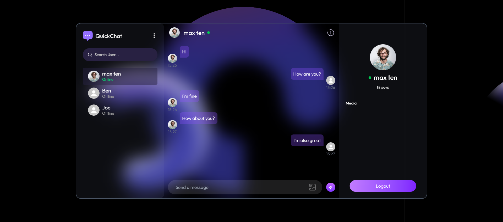
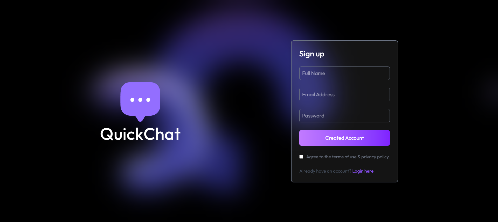
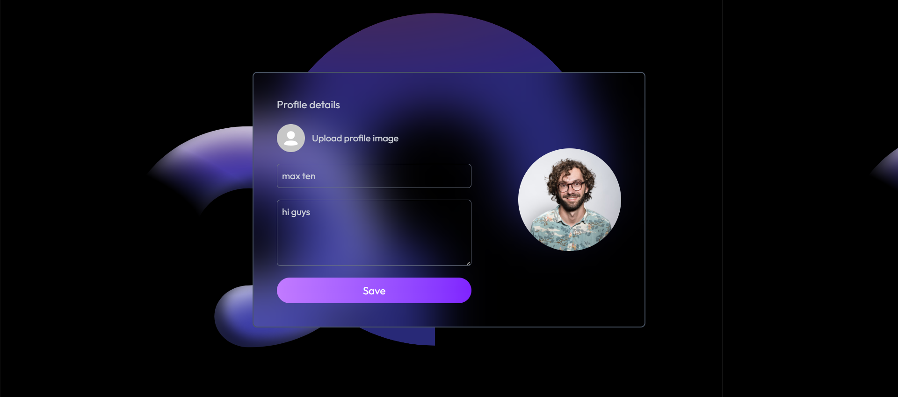

# 💬 ChatApp

A simple real-time chat application built with **Node.js, Express, MongoDB, and Socket.IO**.

---

## 🚀 Features
- Real-time messaging  
- User authentication  
- Chat history  
- Responsive design  

---

## 🛠 Tech Stack
- **Frontend:** HTML, CSS, React  
- **Backend:** Node.js, Express  
- **Database:** MongoDB  
- **Real-Time:** Socket.IO  

---

## 📸 Screenshots

### Chat Room

### Login

### profileedit

